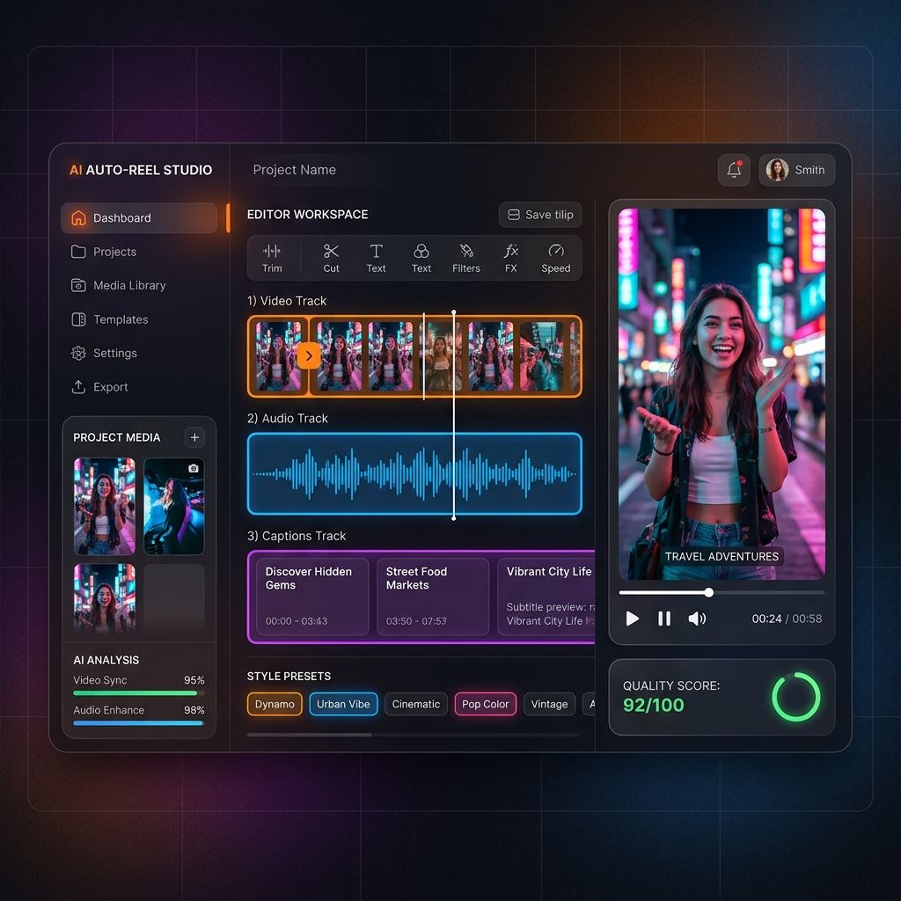

# 🎬 AI Auto-Reel Studio

> **Transform raw video clips, photos, and music into polished, professional short-form reels — 100% locally on your machine.**

[](https://fastapi.tiangolo.com/)
[](https://nextjs.org/)
[](https://www.typescriptlang.org/)
[](https://www.python.org/)
[](https://ffmpeg.org/)
[](https://github.com/SYSTRAN/faster-whisper)
[](#-key-features)

---

## 📸 Application Showcase

### Dashboard & Video Studio UI


### Example 9:16 Reel Output & AI Source Clips

| Generated 9:16 Reel Render | Cyberpunk Scene | Mountain Sunset | Cyber Car Scene |
| :---: | :---: | :---: | :---: |
|  |  |  |  |
| **Rendered Reel (1080x1920 @ 30fps)** | AI Scene 1 | AI Scene 2 | AI Scene 3 |

---

## ✨ Key Features

- 🧠 **AI Frame Quality Scoring & Scene Detection**: Probes input clips for brightness, blurriness, resolution, and audio levels to automatically select the best moments.
- ✂️ **Smart Target Duration & Multi-Aspect Ratio**: Configurable target duration (15s, 30s, 60s) with responsive cropping for vertical **`9:16` Reels/TikToks**, widescreen **`16:9`**, and square **`1:1`** feeds.
- 🎙️ **GPU-Accelerated Auto Subtitles**: Transcribes speech using `faster-whisper` (CUDA accelerated) and burns formatted `.ass` captions into the video.
- 🎨 **Cinematic Color Grading & Dynamic Transitions**: Custom style presets (*Cinematic*, *Energetic*, *Vlog*, *Luxury*) with color grade matrices and smooth transitions (`fade`, `smoothleft`, `smoothright`).
- 🎵 **Audio Mixing & Beat Syncing**: Mixes original clip audio with uploaded music tracks, maintaining voice clarity with background ducking.
- ⚡ **100% Local & In-Process**: Runs entirely on your hardware using FastAPI, SQLite, and FFmpeg. No API keys, cloud subscriptions, or external servers required.

---

## 🏗️ System Architecture

AI Auto-Reel Studio is designed as a single-user, local-first web application with real-time SSE progress streaming and isolated process-pool job execution.

```
                  ┌─────────────────────────────────────────┐
                  │          Next.js 14 Frontend            │
                  │   (TypeScript, TailwindCSS, SSE Client) │
                  └────────────────────┬────────────────────┘
                                       │ HTTP / REST & SSE Stream
                                       ▼
                  ┌─────────────────────────────────────────┐
                  │            FastAPI Backend              │
                  │       (App API Routes & SQLite DB)      │
                  └────────────────────┬────────────────────┘
                                       │ Async Job Dispatch
                                       ▼
                  ┌─────────────────────────────────────────┐
                  │       ProcessPoolExecutor Worker        │
                  │   (app/pipeline/pipeline.py worker)     │
                  └──────┬─────────────┬─────────────┬──────┘
                         │             │             │
        ┌────────────────┘             │             └────────────────┐
        ▼                              ▼                              ▼
┌──────────────┐               ┌──────────────┐               ┌──────────────┐
│ Scene & Quality│              │faster-whisper│               │    FFmpeg    │
│ Analysis     │               │CUDA Transcribe│               │Render Engine │
└──────────────┘               └──────────────┘               └──────────────┘
```

### Complete Pipeline Workflow

```
[Uploaded Clips & Music]
          │
          ▼
┌──────────────────┐
│  1. Ingest Stage │ ──► Probe duration, FPS, resolution & save clip metadata
└─────────┬────────┘
          │
          ▼
┌──────────────────┐
│ 2. Scored Cut    │ ──► Score clip segments, trim low quality frames, select best scenes
└─────────┬────────┘
          │
          ▼
┌──────────────────┐
│ 3. Transcribe    │ ──► Transcribe clip audio with faster-whisper, generate ASS subtitle cards
└─────────┬────────┘
          │
          ▼
┌──────────────────┐
│ 4. FFmpeg Render │ ──► Crop aspect ratio, apply color grading, compose transitions & mix audio
└─────────┬────────┘
          │
          ▼
 [Final MP4 Reel & Thumbnail] (storage/output/job_{id}.mp4)
```

---

## 📂 Project Structure

```
VIDEO EDITOR/
├── assets/                       # README preview images and visual assets
├── backend/                      # FastAPI Python Application
│   ├── app/
│   │   ├── api/                  # API Routers (routes_upload.py, routes_jobs.py, routes_media.py)
│   │   ├── core/                 # Config, DB Models, Schemas, ProcessPool Job Runner
│   │   ├── pipeline/             # Render Pipeline Modules
│   │   │   ├── ingest.py         # Media probing & metadata extraction
│   │   │   ├── timeline.py       # Scored timeline cut & scene selection
│   │   │   ├── captions.py       # Whisper transcription & ASS subtitle builder
│   │   │   ├── render.py         # FFmpeg filtergraph rendering & NVENC encoder
│   │   │   └── pipeline.py       # Full job pipeline orchestrator
│   │   └── main.py               # FastAPI entrypoint & CORS middleware
│   ├── storage/                  # Local storage (uploads, work cache, output MP4s, thumbnails)
│   └── requirements.txt          # Python dependencies
├── docs/                         # Developer documentation
│   ├── SETUP.md                  # Setup & execution guide
│   └── ARCHITECTURE.md           # System design & database schema reference
├── frontend/                     # Next.js 14 App Router Frontend
│   ├── app/                      # Next.js Pages (Home, /jobs, /jobs/[jobId])
│   ├── components/               # React Components (Dropzone, AspectPicker, VideoPreview, TimelineInspector)
│   └── lib/                      # API client, types & utilities
├── scripts/                      # Utility & environment check scripts
│   └── check_env.py              # Environment diagnostic tool (FFmpeg, NVENC, CUDA check)
└── README.md                     # Project documentation
```

---

## 📡 API Reference

| Method | Endpoint | Description |
| :--- | :--- | :--- |
| `GET` | `/api/health` | Backend liveness check |
| `GET` | `/api/env-check` | Reports FFmpeg, NVENC, libass, and CUDA faster-whisper availability |
| `POST` | `/api/uploads/clips` | Upload raw video clip files |
| `POST` | `/api/uploads/photos` | Upload static photo files |
| `POST` | `/api/uploads/music` | Upload background audio/music track |
| `POST` | `/api/jobs` | Create and queue a new reel rendering job |
| `GET` | `/api/jobs` | List all render jobs (newest first) |
| `GET` | `/api/jobs/{id}` | Retrieve job details, status, and progress |
| `GET` | `/api/jobs/{id}/events` | SSE (Server-Sent Events) stream for real-time progress updates |
| `GET` | `/api/jobs/{id}/timeline` | Retrieve calculated timeline JSON (cuts, transitions, captions) |
| `GET` | `/api/jobs/{id}/preview` | Stream final rendered video MP4 |
| `GET` | `/api/jobs/{id}/download` | Download rendered MP4 video file |
| `GET` | `/api/jobs/{id}/thumbnail` | Retrieve generated video thumbnail JPEG |
| `DELETE`| `/api/jobs/{id}/purge` | Permanently delete job and all associated disk storage |

---

## ⚡ Quickstart & Execution

### Prerequisites

- **Python 3.13+**
- **Node.js 24+**
- **FFmpeg**: Installed via WinGet or PATH (`winget install Gyan.FFmpeg`)
- **NVIDIA GPU** *(Optional)*: Drivers & CUDA for NVENC encoding and `faster-whisper` acceleration

### 1. Start Backend Server

```bash
cd backend

# Create & activate virtual environment
python -m venv .venv
# On Windows PowerShell:
.\.venv\Scripts\Activate.ps1

# Install requirements
pip install -r requirements.txt
pip install nvidia-cublas-cu12 "nvidia-cudnn-cu12==9.*"

# Sanity check FFmpeg, NVENC, and Whisper CUDA setup
python ../scripts/check_env.py

# Launch FastAPI backend
uvicorn app.main:app --reload --port 8000
```

### 2. Start Frontend Server

```bash
cd frontend

# Install Node dependencies
npm install

# Launch Next.js dev server
npm run dev
```

Visit **`http://localhost:3000`** in your browser to start creating AI Reels!

---

## 🛠️ Example: Programmatic Reel Generation

```python
import requests

BASE_URL = "http://localhost:8000"

# 1. Upload clips & music
clips_resp = requests.post(
    f"{BASE_URL}/api/uploads/clips",
    files=[
        ("files", ("clip1.mp4", open("clip1.mp4", "rb"), "video/mp4")),
        ("files", ("clip2.mp4", open("clip2.mp4", "rb"), "video/mp4")),
    ]
)
clip_ids = [c["id"] for c in clips_resp.json()]

music_resp = requests.post(
    f"{BASE_URL}/api/uploads/music",
    files={"file": ("music.wav", open("music.wav", "rb"), "audio/wav")}
)
music_id = music_resp.json()["id"]

# 2. Create a 9:16 Cinematic Reel job
job_resp = requests.post(
    f"{BASE_URL}/api/jobs",
    json={
        "clip_ids": clip_ids,
        "photo_ids": [],
        "music_id": music_id,
        "aspect_ratio": "9:16",
        "target_duration": 15.0,
        "style": "cinematic"
    }
)
job_id = job_resp.json()["id"]
print(f"Reel job #{job_id} created!")

# 3. Stream progress via SSE or poll /api/jobs/{id}
```

---

## 📜 Documentation & References

- [SETUP.md](docs/SETUP.md) — Detailed environment setup, dependencies, and troubleshooting.
- [ARCHITECTURE.md](docs/ARCHITECTURE.md) — Technical overview of data models, FFmpeg filtergraphs, and pipeline stages.

---

## 📄 License

MIT License — free for personal and commercial use.
